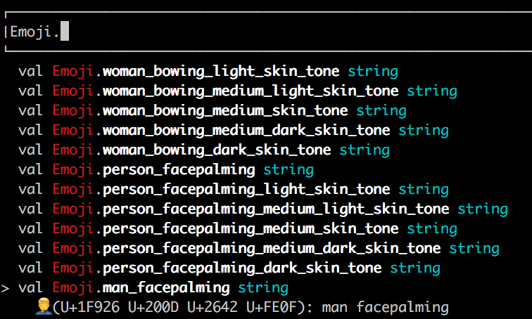
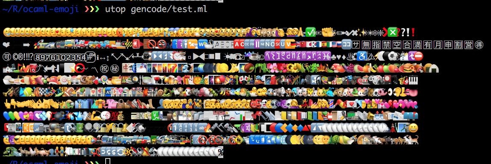

emoji
------

Single OCaml file containing byte sequences of all the Unicode emoji 
characters and sequences sourced from [here](http://www.unicode.org/emoji/charts/emoji-list.html )

```
$ opam install emoji
```

You can see them by printing to the screen: 
```
print_endline Emoji.troll
```
🧌

You can also get all emojis from the same category or subcategory:
```
let best_animals = Emoji.sub_category_animal_reptile in
Array.iter print_string best_animals;
```
🐉🐊🦎🦖🦕🐢🐲🐍

Using `ocp-browser` shows the emoji



# Development 

build with
```
$ dune build @all
```
this will generate `emoji.ml` from `./src/gencode.ml`

You can use `./test/test.ml` to test the code.
Which for me resulted in:

