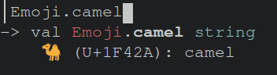

# Emoji

OCaml library providing byte sequences of all the Unicode (v17.0) emoji
characters and sequences

```
$ opam install emoji
```

You can see them by printing to the screen: 
```ocaml
# Emoji.distorted_face;;
- : string = "🫪"
# Emoji.hairy_creature;;
- : string = "🫈"
# Emoji.orca;;
- : string = "🫍"
```

You can also get all emojis from the same category or subcategory:
```ocaml
# let best_animals = Emoji.sub_category_animal_reptile;;
val best_animals : string array =
  [|"🐊"; "🐉"; "🐲"; "🦎"; "🦕"; "🐍"; "🦖"; "🐢"|]
```

Using `ocp-browser` shows the emoji



# Development 

To generate `emoji.ml`, first update the source html files:
```
$ wget "https://www.unicode.org/emoji/charts/full-emoji-list.html"
$ wget "https://www.unicode.org/emoji/charts/full-emoji-modifiers.html"
```

then run:
```
$ dune exec gencode/gencode.exe > src/emoji.ml
```
test with `dune runtest`, you can then `dune promote` to apply [mdx](https://github.com/realworldocaml/mdx) changes to keep this file up to date.

